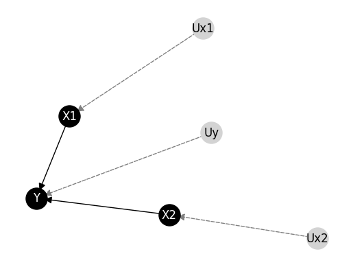

# Divide and Conquer Approach for Causal Computation

This bundle contains the manuscript published at _International Journal of Approximate Reasoning_ and entitled  "A Divide and Conquer Approach for Causal Computation".
The organisation  is the following:

- _examples_: a toy example for running the method proposed in the paper.
- _ctfzeros_: python sources implementing the method.
- _models_: set of structural causal models in UAI format considered in the experimentation.
- _requirements.txt_: code dependencies.


## Setup
First of all, check the Python version. This sources have been coded with the following Python version:


```python
!python --version
```

    Python 3.11.2


Then, install the dependencies in the `requirement.txt` file. The main dependency is the python packege `bcause` (https://github.com/PGM-Lab/bcause).


```python
!pip install --upgrade pip setuptools wheel
!pip install -r ./requirements.txt
```

## Model and data

In this repository, we provide functionality for preprocessing the model and data so they could work we our inference algorithm:


```python
from ctfzeros.prepro import load_and_preprocess
```


```python
filepath = "./models/synthetic/simple_nparents2_nzr10_zdr05_13.uai"
datapath = "./models/synthetic/simple_nparents2_nzr10_zdr05_13.csv"

model, data, _, _ = load_and_preprocess(filepath, datapath)
model
```


    <StructuralCausalModel (Y:2,X2:2,X1:2|Uy:16,Ux1:2,Ux2:2), dag=[Uy][Y|Uy:X2:X1][X2|Ux2][X1|Ux1][Ux1][Ux2]>


```python
model.draw()
```


    

    


```python
data
```


<div>
<style scoped>
    .dataframe tbody tr th:only-of-type {
        vertical-align: middle;
    }

    .dataframe tbody tr th {
        vertical-align: top;
    }

    .dataframe thead th {
        text-align: right;
    }
</style>
<table border="1" class="dataframe">
  <thead>
    <tr style="text-align: right;">
      <th></th>
      <th>X2</th>
      <th>X1</th>
      <th>Y</th>
    </tr>
  </thead>
  <tbody>
    <tr>
      <th>0</th>
      <td>0</td>
      <td>1</td>
      <td>0</td>
    </tr>
    <tr>
      <th>1</th>
      <td>1</td>
      <td>1</td>
      <td>0</td>
    </tr>
    <tr>
      <th>2</th>
      <td>0</td>
      <td>1</td>
      <td>1</td>
    </tr>
    <tr>
      <th>3</th>
      <td>0</td>
      <td>1</td>
      <td>1</td>
    </tr>
    <tr>
      <th>4</th>
      <td>0</td>
      <td>1</td>
      <td>1</td>
    </tr>
    <tr>
      <th>...</th>
      <td>...</td>
      <td>...</td>
      <td>...</td>
    </tr>
    <tr>
      <th>995</th>
      <td>0</td>
      <td>1</td>
      <td>1</td>
    </tr>
    <tr>
      <th>996</th>
      <td>0</td>
      <td>1</td>
      <td>0</td>
    </tr>
    <tr>
      <th>997</th>
      <td>0</td>
      <td>1</td>
      <td>1</td>
    </tr>
    <tr>
      <th>998</th>
      <td>0</td>
      <td>1</td>
      <td>0</td>
    </tr>
    <tr>
      <th>999</th>
      <td>0</td>
      <td>1</td>
      <td>1</td>
    </tr>
  </tbody>
</table>
<p>1000 rows × 3 columns</p>
</div>


## Counterfactual inference

First, load corresponding modules for using DCCC and EMCC:


```python
from ctfzeros.divideconquer import DCCC_inverted_tree
from bcause.inference.causal.multi import EMCC
```

Set up the DCCC inference engine with a number of solutions $N=20$. Then calculate the probability of sufficiency $PS(X_2,Y)$:


```python

infDCCC = DCCC_inverted_tree(model, data, num_runs=20)
infDCCC.prob_sufficiency("X1", "Y")

```


    [0.22996883482457, 0.6933748869005733]


Alternatively, each individual query can be obtained as follows:

Similarly, with the state of the art method EMCC interating up to 100 iterations each EM run.


```python
infEMCC = EMCC(model,data,num_runs=20, max_iter=100)
infEMCC.prob_sufficiency("X1","Y")

